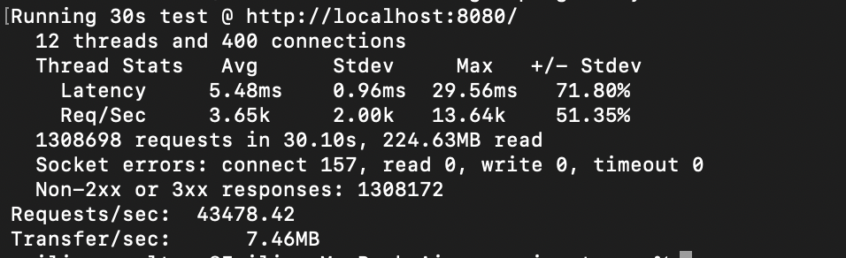

# High-Performance Distributed API Gateway


A high-throughput, distributed API Gateway written in Go, designed to handle massive traffic loads with atomic rate-limiting using Redis + Lua Scripts.

This project implements the Token Bucket Algorithm to control traffic flow, ensuring reliability and preventing abuse. It includes real-time observability via Prometheus, automated testing via GitHub Actions, and containerization with Docker.

---

## Performance Benchmarks

Tested on a MacBook Air (M4) using wrk with 12 threads and 400 concurrent connections.

> Result: ~43,000 Requests per Second (RPS) with 5ms latency.



* Total Requests: ~1.3 Million in 30 seconds.
* Resilience: Successfully blocked ~1.3M excess requests (HTTP 429) while allowing legitimate traffic, proving the efficiency of the Redis/Lua locking mechanism.

---

## Architecture

The system follows a clean, modular architecture:

* Core Logic (internal/limiter): Implements the Token Bucket algorithm. It uses Lua scripts within Redis to ensure that checking and consuming tokens is an atomic operation, preventing race conditions in distributed environments.
* Reverse Proxy (internal/proxy): Forwards allowed traffic to the backend service transparently.
* Observability: Exposes custom Prometheus metrics (api_gateway_requestsTotal) to track accepted vs. blocked requests in real-time.
* CI/CD: Automated testing pipeline running on Ubuntu environments via GitHub Actions.

### Tech Stack
* Language: Go (Golang)
* Database: Redis (for distributed state management)
* Infrastructure: Docker & Docker Compose
* Testing: testing (Standard Lib) + miniredis (Mock Redis)
* Metrics: Prometheus Client

---

## Installation & Setup

### Prerequisites
* Docker & Docker Compose
* Go 1.25+ (Optional, for local development)

### Option A: Run everything with Docker (Recommended)
This will spin up the API Gateway and Redis in isolated containers.

docker-compose up --build

The server will start on port 8080.

### Option B: Local Development
Run Redis in Docker and the Go app locally for debugging.

1. Start Redis:
   docker-compose up -d redis

2. Run the Application:
   go run cmd/main.go

---

## Usage

The API Gateway enforces rate limits based on the X-Api-Key header.

### 1. Valid Request (Free Tier)
* Limit: 5 requests.
* Refill Rate: 0.5 tokens/sec.


curl -i -H "X-Api-Key: free-membership-token" http://localhost:8080/

### 2. Valid Request (Paid Tier)
* Limit: 10 requests.
* Refill Rate: 5.0 tokens/sec.

curl -i -H "X-Api-Key: paid-membership-token" http://localhost:8080/


### 3. Rate Limit Triggered
If you exceed the limit, the server responds with:
* Status: 429 Too Many Requests
* Body: Many petitions

---

## Observability (Prometheus)

The application exposes metrics at /metrics.

1. Access http://localhost:8080/metrics in your browser.
2. Look for the custom metric:

# HELP api_gateway_requestsTotal Requests processed by the Gateway
api_gateway_requestsTotal{status="accepted-requests"} 1250
api_gateway_requestsTotal{status="blocked-requests"} 5043

This allows for real-time monitoring of traffic spikes and attack attempts.

---

## Testing

The project includes Unit Tests and Integration Tests using miniredis to simulate Redis without needing a live instance.

Run the test suite:
go test -v ./...

---
## Project Structure

```text
.
├── .github
│   └── workflows
│       └── ci.yml      # CI/CD Pipeline
├── cmd
│   └── main.go         # Entry point & HTTP Server
├── internal
│   ├── limiter         # Token Bucket Logic & Redis Client
│   ├── mock            # Mock Backend Server
│   └── proxy           # Reverse Proxy Logic
├── Dockerfile          # Multi-stage build
├── docker-compose.yml  # Container orchestration
├── go.mod              # Go Dependencies
└── README.md           # Documentation
---

```

## License
This project is open-source and available under the MIT License.